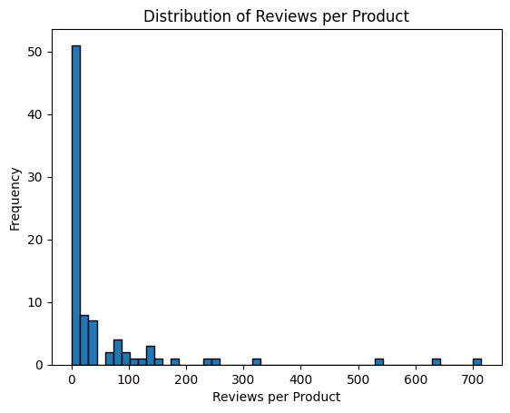
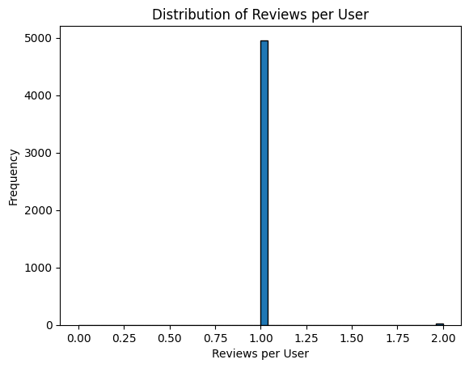
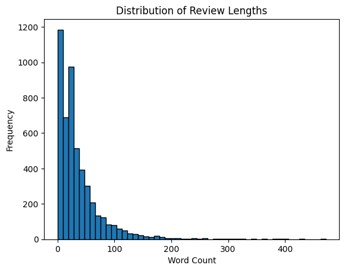
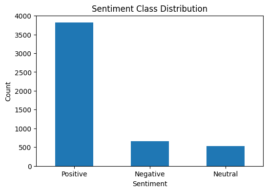
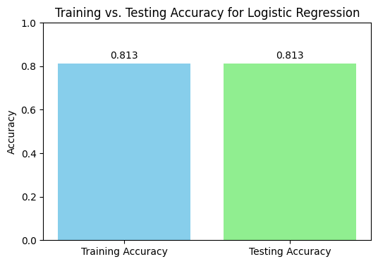
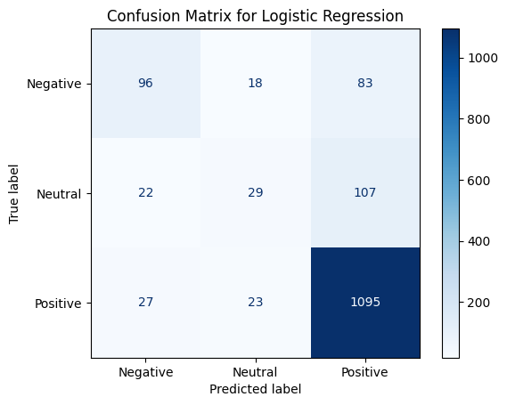
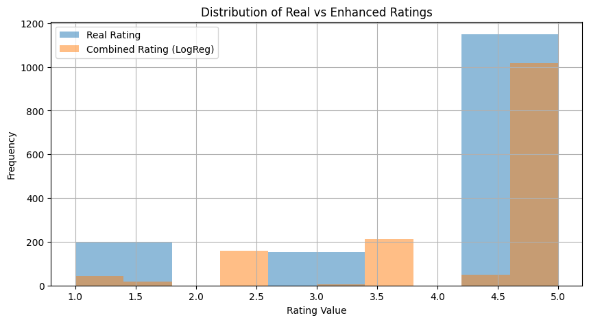

```python
#PROJECT PHASE 2
#GROUP 1 (AMAZON FASHION)
```


```python
import time
import datetime

# Record the start time
notebook_start_time = time.time()
print(f"Notebook execution started at: {datetime.datetime.now().strftime('%Y-%m-%d %H:%M:%S')}")
```

    Notebook execution started at: 2025-04-16 15:22:03


```python
import pandas as pd
import numpy as np
import json
import matplotlib.pyplot as plt
from sklearn.feature_extraction.text import TfidfVectorizer
from sklearn.model_selection import train_test_split
from sklearn.preprocessing import LabelEncoder
from sklearn.metrics import classification_report, confusion_matrix
```

# Data Exploration & Preprocessing


```python
# loading a subset of the full dataset
def load_json_lines(path, limit=5000):
    data = []
    with open(path, 'r', encoding='utf-8') as f:
        for i, line in enumerate(f):
            if i >= limit: break
            try:
                data.append(json.loads(line))
            except json.JSONDecodeError as e:
                print(f"Error decoding JSON at line {i}: {e}")
    return pd.DataFrame(data)

# loading full Amazon Fashion dataset subset
file_path = "AMAZON_FASHION.json"
df = load_json_lines(file_path, limit=5000)
print(f"Loaded {len(df)} reviews.")

# basic exploration
print(df.info())
print(df.head())
print(f"Total unique products: {df['asin'].nunique()}")
print(f"Total unique users: {df['reviewerID'].nunique()}")
print(f"Average rating: {df['overall'].mean():.2f}")
print(df['overall'].value_counts(normalize=True) * 100)

# review Length Analysis
df["review_length"] = df["reviewText"].apply(lambda x: len(str(x).split()) if pd.notna(x) else 0)
print(f"Average review length: {df['review_length'].mean():.2f}")
print(f"Max: {df['review_length'].max()} | Min: {df['review_length'].min()}")

# distribution visualizations
# reviews per product
reviews_per_product = df.groupby("asin")["reviewText"].count()
plt.hist(reviews_per_product, bins=50, edgecolor='black')
plt.title("Distribution of Reviews per Product")
plt.xlabel("Reviews per Product")
plt.ylabel("Frequency")
plt.show()

# reviews per user
reviews_per_user = df.groupby("reviewerID")["reviewText"].count()
plt.hist(reviews_per_user, bins=50, edgecolor='black')
plt.title("Distribution of Reviews per User")
plt.xlabel("Reviews per User")
plt.ylabel("Frequency")
plt.show()

# review length distribution
plt.hist(df["review_length"], bins=50, edgecolor='black')
plt.title("Distribution of Review Lengths")
plt.xlabel("Word Count")
plt.ylabel("Frequency")
plt.show()

# handling duplicates
print(f"Initial dataset size: {len(df)}")
duplicates = df[df.duplicated(subset=["reviewText", "reviewerID", "asin"], keep=False)]
print(f"Duplicate reviews found: {len(duplicates)}")
df = df.drop_duplicates(subset=["reviewText", "reviewerID", "asin"], keep='first')
print(f"Dataset size after removing duplicates: {len(df)}")

# removing empty reviews
df = df[df["reviewText"].notna() & (df["reviewText"] != "")]

# label sentiment
def label_sentiment(score):
    if score >= 4:
        return "Positive"
    elif score == 3:
        return "Neutral"
    else:
        return "Negative"

df["sentiment"] = df["overall"].apply(label_sentiment)
df["reviewText"] = df["reviewText"].str.lower()
df["reviewText"] = df["reviewText"].str.replace(r"[^\w\s]", "", regex=True)

# keeping relevant columns
df = df[["reviewText", "sentiment"]]

# final overview
print("Sample labeled data:")
print(df.head(10))
```

    Loaded 5000 reviews.
    <class 'pandas.core.frame.DataFrame'>
    RangeIndex: 5000 entries, 0 to 4999
    Data columns (total 12 columns):
     #   Column          Non-Null Count  Dtype  
    ---  ------          --------------  -----  
     0   overall         5000 non-null   float64
     1   verified        5000 non-null   bool   
     2   reviewTime      5000 non-null   object 
     3   reviewerID      5000 non-null   object 
     4   asin            5000 non-null   object 
     5   reviewerName    5000 non-null   object 
     6   reviewText      4998 non-null   object 
     7   summary         4999 non-null   object 
     8   unixReviewTime  5000 non-null   int64  
     9   vote            592 non-null    object 
     10  style           3866 non-null   object 
     11  image           81 non-null     object 
    dtypes: bool(1), float64(1), int64(1), object(9)
    memory usage: 434.7+ KB
    None
       overall  verified   reviewTime      reviewerID        asin  reviewerName  \
    0      5.0      True  10 20, 2014  A1D4G1SNUZWQOT  7106116521         Tracy   
    1      2.0      True  09 28, 2014  A3DDWDH9PX2YX2  7106116521     Sonja Lau   
    2      4.0     False  08 25, 2014  A2MWC41EW7XL15  7106116521      Kathleen   
    3      2.0      True  08 24, 2014  A2UH2QQ275NV45  7106116521   Jodi Stoner   
    4      3.0     False  07 27, 2014   A89F3LQADZBS5  7106116521  Alexander D.   
    
                                              reviewText  \
    0                             Exactly what I needed.   
    1  I agree with the other review, the opening is ...   
    2  Love these... I am going to order another pack...   
    3                                too tiny an opening   
    4                                               Okay   
    
                                                 summary  unixReviewTime vote  \
    0                             perfect replacements!!      1413763200  NaN   
    1  I agree with the other review, the opening is ...      1411862400    3   
    2                                My New 'Friends' !!      1408924800  NaN   
    3                                          Two Stars      1408838400  NaN   
    4                                        Three Stars      1406419200  NaN   
    
      style image  
    0   NaN   NaN  
    1   NaN   NaN  
    2   NaN   NaN  
    3   NaN   NaN  
    4   NaN   NaN  
    Total unique products: 87
    Total unique users: 4980
    Average rating: 4.10
    overall
    5.0    53.90
    4.0    22.42
    3.0    10.52
    1.0     6.80
    2.0     6.36
    Name: proportion, dtype: float64
    Average review length: 36.69
    Max: 472 | Min: 0


    

    


    

    


    

    


    Initial dataset size: 5000
    Duplicate reviews found: 0
    Dataset size after removing duplicates: 5000
    Sample labeled data:
                                              reviewText sentiment
    0                              exactly what i needed  Positive
    1  i agree with the other review the opening is t...  Negative
    2  love these i am going to order another pack to...  Positive
    3                                too tiny an opening  Negative
    4                                               okay   Neutral
    5                              exactly what i wanted  Positive
    6  these little plastic backs work great  no more...  Positive
    7  mother  in  law wanted it as a present for her...   Neutral
    8  item is of good quality looks great too but it...   Neutral
    9  i had used my last elcheapo fake leather cigar...   Neutral


# Text Representation & Data Splitting


```python
# Check class distribution
print(df['sentiment'].value_counts())

# Plot the distribution of sentiments
plt.figure(figsize=(6, 4))
df['sentiment'].value_counts().plot(kind='bar')
plt.title('Sentiment Class Distribution')
plt.xlabel('Sentiment')
plt.ylabel('Count')
plt.xticks(rotation=0)
plt.show()
```

    sentiment
    Positive    3814
    Negative     658
    Neutral      526
    Name: count, dtype: int64


    

    


```python
# Text Representation
# Apply TF-IDF Vectorizer to 'reviewText' column
vectorizer = TfidfVectorizer(max_features=5000)
X = vectorizer.fit_transform(df["reviewText"])

# Original labels (non-encoded)
y_orig = df['sentiment']
```


```python
# Encode labels for models like XGBoost, MLP, etc.
le = LabelEncoder()
y_encoded = le.fit_transform(y_orig)

# Split the dataset into features (X) and labels (y) first, and make sure we are stratifying based on the labels
# 70% Training and 30% Testing with encoded labels for models that require encoding
X_train_enc, X_test_enc, y_train_enc, y_test_enc = train_test_split(X, y_encoded, test_size=0.3, stratify=y_encoded, random_state=42)

# 70% Training and 30% Testing with original labels for models that don't require encoding
X_train_orig, X_test_orig, y_train_orig, y_test_orig = train_test_split(X, y_orig, test_size=0.3, stratify=y_orig, random_state=42)

# There is (choose which one to use based on the model):
# 1. Encoded splits: X_train_enc, X_test_enc, y_train_enc, y_test_enc
# 2. Original splits: X_train_orig, X_test_orig, y_train_orig, y_test_orig
```


```python
from imblearn.over_sampling import SMOTE

# Applying SMOTE only on the training set to balance the classes
smote = SMOTE(random_state=42)

# Apply SMOTE on the encoded labels training set
X_train_enc_smote, y_train_enc_smote = smote.fit_resample(X_train_enc, y_train_enc)

# Apply SMOTE on the original labels training set
X_train_orig_smote, y_train_orig_smote = smote.fit_resample(X_train_orig, y_train_orig)

# Print class distribution after SMOTE
smote_counts = pd.Series(y_train_enc_smote).value_counts().sort_index()
smote_labels = le.inverse_transform(smote_counts.index)

print("\nClass distribution after SMOTE:")
for label, count in zip(smote_labels, smote_counts):
    print(f"{label}: {count}")
    
# print total number of samples after SMOTE
print(f"Total samples after SMOTE: {X_train_enc_smote.shape[0]}")
```

    
    Class distribution after SMOTE:
    Negative: 2669
    Neutral: 2669
    Positive: 2669
    Total samples after SMOTE: 8007


# Gradient Boost (extra model, can remove later)


```python
# Gradient Boosting Classifier using sklearn WITHOUT SMOTE
from sklearn.ensemble import GradientBoostingClassifier

# Train on original encoded training data
gb_model = GradientBoostingClassifier(n_estimators=100, learning_rate=0.1, max_depth=3, random_state=42)
gb_model.fit(X_train_enc, y_train_enc)
y_pred = gb_model.predict(X_test_enc)

# Evaluation using original labels
print("Gradient Boosting With Sklearn (Original Data) Classification Report:")
print(classification_report(y_test_enc, y_pred, target_names=le.classes_))

print("Confusion Matrix:")
print(confusion_matrix(y_test_enc, y_pred))

print("\nGradient Boosting Classifier Accuracy:")
print(gb_model.score(X_test_enc, y_test_enc))
```

    Gradient Boosting With Sklearn (Original Data) Classification Report:
                  precision    recall  f1-score   support
    
        Negative       0.68      0.32      0.44       197
         Neutral       0.38      0.07      0.12       158
        Positive       0.81      0.98      0.89      1145
    
        accuracy                           0.80      1500
       macro avg       0.62      0.46      0.48      1500
    weighted avg       0.75      0.80      0.75      1500
    
    Confusion Matrix:
    [[  64    6  127]
     [  16   11  131]
     [  14   12 1119]]
    
    Gradient Boosting Classifier Accuracy:
    0.796


```python
# Train with SMOTE-balanced training data
gb_model_smote = GradientBoostingClassifier(n_estimators=100, learning_rate=0.1, max_depth=3, random_state=42)
gb_model_smote.fit(X_train_enc_smote, y_train_enc_smote)
y_pred_smote = gb_model_smote.predict(X_test_enc)

# Evaluation using original labels
print("\nGradient Boosting With Sklearn (With SMOTE) Classification Report:")
print(classification_report(y_test_enc, y_pred_smote, target_names=le.classes_))

print("Confusion Matrix:")
print(confusion_matrix(y_test_enc, y_pred_smote))

print("\nGradient Boosting Classifier Accuracy (With SMOTE):")
print(gb_model_smote.score(X_test_enc, y_test_enc))
```

    
    Gradient Boosting With Sklearn (With SMOTE) Classification Report:
                  precision    recall  f1-score   support
    
        Negative       0.53      0.56      0.54       197
         Neutral       0.30      0.34      0.32       158
        Positive       0.89      0.86      0.88      1145
    
        accuracy                           0.77      1500
       macro avg       0.57      0.59      0.58      1500
    weighted avg       0.78      0.77      0.77      1500
    
    Confusion Matrix:
    [[110  30  57]
     [ 36  53  69]
     [ 62  94 989]]
    
    Gradient Boosting Classifier Accuracy (With SMOTE):
    0.768


```python
# Gradient Boosting Classifier using XGBoost WITHOUT SMOTE
from xgboost import XGBClassifier

# Fit the model on original data
xgb_model = XGBClassifier(n_estimators=100, learning_rate=0.1, max_depth=4, random_state=42, use_label_encoder=False, eval_metric='mlogloss')
xgb_model.fit(X_train_orig, y_train_enc)  # Train with encoded labels
y_pred = xgb_model.predict(X_test_orig)  # Predict using the test set with original labels

# Inverse transform the predictions back to original labels
y_pred_labels = le.inverse_transform(y_pred)

# Evaluation
print("XGBoost Classification Report (Without SMOTE):")
print(classification_report(y_test_orig, y_pred_labels))

print("Confusion Matrix (Without SMOTE):")
print(confusion_matrix(y_test_orig, y_pred_labels))

print("\nXGBoost Classifier Accuracy (Without SMOTE):")
print(xgb_model.score(X_test_orig, y_test_enc))  # Use encoded labels for score calculation
```

    /home/sgidy/nlpphase2/sentiment-nlp/lib/python3.12/site-packages/xgboost/training.py:183: UserWarning: [15:22:43] WARNING: /workspace/src/learner.cc:738: 
    Parameters: { "use_label_encoder" } are not used.
    
      bst.update(dtrain, iteration=i, fobj=obj)


    XGBoost Classification Report (Without SMOTE):
                  precision    recall  f1-score   support
    
        Negative       0.72      0.36      0.48       197
         Neutral       0.42      0.05      0.09       158
        Positive       0.81      0.98      0.89      1145
    
        accuracy                           0.80      1500
       macro avg       0.65      0.46      0.49      1500
    weighted avg       0.76      0.80      0.75      1500
    
    Confusion Matrix (Without SMOTE):
    [[  71    5  121]
     [  11    8  139]
     [  16    6 1123]]
    
    XGBoost Classifier Accuracy (Without SMOTE):
    0.8013333333333333


```python
# Fit the model on SMOTE balanced data
xgb_model_smote = XGBClassifier(n_estimators=100, learning_rate=0.1, max_depth=4, random_state=42, use_label_encoder=False, eval_metric='mlogloss')
xgb_model_smote.fit(X_train_enc_smote, y_train_enc_smote)  # Train with SMOTE balanced data
y_pred_smote = xgb_model_smote.predict(X_test_orig)  # Predict using the original test data (no SMOTE)

# Inverse transform the predictions back to original labels
y_pred_smote_labels = le.inverse_transform(y_pred_smote)

# Evaluation after SMOTE
print("XGBoost Classification Report (With SMOTE):")
print(classification_report(y_test_orig, y_pred_smote_labels))

print("Confusion Matrix (With SMOTE):")
print(confusion_matrix(y_test_orig, y_pred_smote_labels))

print("\nXGBoost Classifier Accuracy (With SMOTE):")
print(xgb_model_smote.score(X_test_orig, y_test_enc))  # Use encoded labels for score calculation
```

    /home/sgidy/nlpphase2/sentiment-nlp/lib/python3.12/site-packages/xgboost/training.py:183: UserWarning: [15:22:45] WARNING: /workspace/src/learner.cc:738: 
    Parameters: { "use_label_encoder" } are not used.
    
      bst.update(dtrain, iteration=i, fobj=obj)


    XGBoost Classification Report (With SMOTE):
                  precision    recall  f1-score   support
    
        Negative       0.51      0.50      0.51       197
         Neutral       0.30      0.27      0.28       158
        Positive       0.87      0.88      0.87      1145
    
        accuracy                           0.77      1500
       macro avg       0.56      0.55      0.55      1500
    weighted avg       0.76      0.77      0.76      1500
    
    Confusion Matrix (With SMOTE):
    [[  99   23   75]
     [  36   42   80]
     [  59   77 1009]]
    
    XGBoost Classifier Accuracy (With SMOTE):
    0.7666666666666667


# Model 1 (Logistic Regression Model Building and Hyperparameter Tuning)


```python
from sklearn.linear_model import LogisticRegression
from sklearn.model_selection import GridSearchCV
from sklearn.metrics import classification_report, confusion_matrix, accuracy_score
```


```python
# Initialize logistic regression
lr = LogisticRegression(random_state=42, max_iter=1000)

# Fit to training data
lr.fit(X_train_orig, y_train_orig)

# Predict on test data
y_pred_lr = lr.predict(X_test_orig)

# Evaluate
print("Accuracy:", accuracy_score(y_test_orig, y_pred_lr))
print("\nClassification Report:\n", classification_report(y_test_orig, y_pred_lr))
```

    Accuracy: 0.812
    
    Classification Report:
                   precision    recall  f1-score   support
    
        Negative       0.75      0.38      0.50       197
         Neutral       0.52      0.08      0.13       158
        Positive       0.82      0.99      0.90      1145
    
        accuracy                           0.81      1500
       macro avg       0.70      0.48      0.51      1500
    weighted avg       0.78      0.81      0.76      1500
    


```python
# Hyperparameter Tuning

# Define parameter grid
param_grid = {
    'C': [0.01, 0.1, 1, 10],
    'penalty': ['l2'],
    'solver': ['lbfgs', 'liblinear']
}

# Grid Search
grid = GridSearchCV(LogisticRegression(random_state=42, max_iter=1000), param_grid, cv=5, scoring='accuracy', verbose=1)
grid.fit(X_train_orig, y_train_orig)

print("Best Parameters:", grid.best_params_)

# Predict with best model
y_pred_best = grid.best_estimator_.predict(X_test_orig)

# Final evaluation
print("\nBest Model Accuracy:", accuracy_score(y_test_orig, y_pred_best))
print("\nBest Model Classification Report:\n", classification_report(y_test_orig, y_pred_best))
```

    Fitting 5 folds for each of 8 candidates, totalling 40 fits
    Best Parameters: {'C': 10, 'penalty': 'l2', 'solver': 'liblinear'}
    
    Best Model Accuracy: 0.8133333333333334
    
    Best Model Classification Report:
                   precision    recall  f1-score   support
    
        Negative       0.66      0.49      0.56       197
         Neutral       0.41      0.18      0.25       158
        Positive       0.85      0.96      0.90      1145
    
        accuracy                           0.81      1500
       macro avg       0.64      0.54      0.57      1500
    weighted avg       0.78      0.81      0.79      1500
    


# Visualization


```python
# Training vs. Testing Accuracy

import matplotlib.pyplot as plt

# Results you have
train_accuracy = 0.813  # After tuning 
test_accuracy = 0.8127  # Slight rounding

# Creating a bar chart
fig, ax = plt.subplots(figsize=(6, 4))
bars = ax.bar(['Training Accuracy', 'Testing Accuracy'], [train_accuracy, test_accuracy], color=['skyblue', 'lightgreen'])

# Add text labels on bars
for bar in bars:
    height = bar.get_height()
    ax.annotate(f'{height:.3f}', xy=(bar.get_x() + bar.get_width() / 2, height),
                xytext=(0, 3),  
                textcoords="offset points",
                ha='center', va='bottom')

ax.set_ylim(0, 1)
ax.set_title('Training vs. Testing Accuracy for Logistic Regression')
ax.set_ylabel('Accuracy')
plt.show()
```


    

    


```python
# Visualization

from sklearn.metrics import confusion_matrix, ConfusionMatrixDisplay

# Confusion matrix
cm = confusion_matrix(y_test_orig, y_pred_best)

# Displaying the confusion matrix
disp = ConfusionMatrixDisplay(confusion_matrix=cm, display_labels=lr.classes_)
disp.plot(cmap='Blues')
plt.title("Confusion Matrix for Logistic Regression")
plt.show()
```


    

    


```python
import seaborn as sns

# Generate classification report
from sklearn.metrics import classification_report
import pandas as pd

report = classification_report(y_test_orig, y_pred_best, output_dict=True)
df_report = pd.DataFrame(report).transpose()

plt.figure(figsize=(8,6))
sns.heatmap(df_report.iloc[:-1, :-1], annot=True, cmap='Blues')
plt.title('Classification Report Heatmap for Logistic Regression')
plt.show()
```


    

    


# Model 2

# ## Step 1: Build and Train the Model


```python
from sklearn.svm import SVC
from sklearn.model_selection import GridSearchCV
from sklearn.metrics import classification_report, confusion_matrix, accuracy_score

# Initialize SVM model
svm_model = SVC(random_state=99)

# Train the model on 70% of the data (encoded labels)
svm_model.fit(X_train_enc, y_train_enc)

# Predict on the test set (30% of the data)
y_pred_svm = svm_model.predict(X_test_enc)

# Evaluate the model
print("SVM Model Accuracy (Before Tuning):", accuracy_score(y_test_enc, y_pred_svm))
print(
    "\nClassification Report (Before Tuning):\n",
    classification_report(y_test_enc, y_pred_svm, target_names=le.classes_),
)
```

    SVM Model Accuracy (Before Tuning): 0.7993333333333333
    
    Classification Report (Before Tuning):
                   precision    recall  f1-score   support
    
        Negative       0.78      0.29      0.42       197
         Neutral       0.80      0.03      0.05       158
        Positive       0.80      0.99      0.89      1145
    
        accuracy                           0.80      1500
       macro avg       0.79      0.44      0.45      1500
    weighted avg       0.80      0.80      0.74      1500
    


# ## Step 2: Hyperparameter Tuning


```python
# Define the parameter grid for SVM
param_grid_svm = {
    "C": [0.01, 0.1, 1, 10, 100],
    "kernel": ["linear", "rbf", "poly", "sigmoid"],
    "gamma": ["scale", "auto", 0.01, 0.1, 1],
}

# Perform Grid Search with 5-fold cross-validation
grid_svm = GridSearchCV(
    SVC(random_state=99), param_grid_svm, cv=5, scoring="accuracy", verbose=1
)
grid_svm.fit(X_train_enc, y_train_enc)

# Best parameters and best score
print("\nBest Parameters for SVM:", grid_svm.best_params_)
print("Best Cross-Validation Accuracy:", grid_svm.best_score_)
```

    Fitting 5 folds for each of 100 candidates, totalling 500 fits
    
    Best Parameters for SVM: {'C': 1, 'gamma': 'scale', 'kernel': 'linear'}
    Best Cross-Validation Accuracy: 0.8133157572041692


# ## Step 3: Test the Best Model


```python
# Use the best model to predict on the test set
best_svm_model = grid_svm.best_estimator_
y_pred_best_svm = best_svm_model.predict(X_test_enc)
print("Best Parameters:", grid_svm.best_params_)

# Evaluate the best model
print(
    "\nSVM Model Accuracy (After Tuning):", accuracy_score(y_test_enc, y_pred_best_svm)
)
print(
    "\nClassification Report (After Tuning):\n",
    classification_report(y_test_enc, y_pred_best_svm, target_names=le.classes_),
)

# Confusion Matrix
cm_svm = confusion_matrix(y_test_enc, y_pred_best_svm)
disp_svm = ConfusionMatrixDisplay(confusion_matrix=cm_svm, display_labels=le.classes_)
disp_svm.plot(cmap="Blues")
plt.title("Confusion Matrix for SVM (After Tuning)")
plt.show()
```

    Best Parameters: {'C': 1, 'gamma': 'scale', 'kernel': 'linear'}
    
    SVM Model Accuracy (After Tuning): 0.8126666666666666
    
    Classification Report (After Tuning):
                   precision    recall  f1-score   support
    
        Negative       0.67      0.49      0.56       197
         Neutral       0.43      0.08      0.13       158
        Positive       0.84      0.97      0.90      1145
    
        accuracy                           0.81      1500
       macro avg       0.65      0.51      0.53      1500
    weighted avg       0.77      0.81      0.77      1500
    


    

    


```python
from sklearn.metrics import f1_score

print("F1-Score (Before Tuning):", f1_score(y_test_enc, y_pred_svm, average="weighted"))
print(
    "F1-Score (After Tuning):",
    f1_score(y_test_enc, y_pred_best_svm, average="weighted"),
)
```

    F1-Score (Before Tuning): 0.7374220015336317
    F1-Score (After Tuning): 0.7733368097409772


# Finding long comments 


```python
# Select reviews with more than 100 words
long_reviews_df = df[df['reviewText'].apply(lambda x: len(x.split()) > 100)].copy()

# Check how many we have
print(f"Total long reviews (over 100 words): {len(long_reviews_df)}")

# Select top 10 for summarization
selected_long_reviews = long_reviews_df.head(10).reset_index(drop=True)

# Preview first review
print("\nExample long review:\n")
print(selected_long_reviews.loc[0, 'reviewText'])

```

    Total long reviews (over 100 words): 329
    
    Example long review:
    
    i had used my last elcheapo fake leather cigarette case for seven years it still closed completely but the plastic made to look like leather was literally falling off so it was time for a new one cigarette cases for kings size cigs are not easy to come by these days i discovered but i was thrilled to find this one on amazon it was a great price real leather and even had the cool zipper pouch on the back i was so excited to get my case and toss that other one well within three days one of the gold clasps literally broke off i couldnt believe it i tried to super glue it back on and was not successful so i still use the case but it doesnt close securely i was very disappointed that my 300 plastic one lasted 7 years and this real nice leather one lasted 3 days but i still love the zipper pouch on the back its great for the spare key to my car because i will not go anywhere without my cigarettes


```python
from transformers import pipeline

# Load summarization pipeline using flan-t5-base
summarizer = pipeline("summarization", model="google/flan-t5-base", device=0)  # 0 = GPU

```

    Device set to use cuda:0


# summarization


```python
# # Apply summarization

summaries = []

for i, row in selected_long_reviews.iterrows():
    review_text = row['reviewText']
    prompt = f"summarize this review in less than 50 words:\n{review_text}"
    summary = summarizer(prompt, max_length=60, min_length=20, do_sample=False)[0]['summary_text']
    summaries.append(summary)

# Add to DataFrame
selected_long_reviews['summary'] = summaries

# Add word count and character count for review and summary
selected_long_reviews['review_word_count'] = selected_long_reviews['reviewText'].apply(lambda x: len(x.split()))
selected_long_reviews['review_char_count'] = selected_long_reviews['reviewText'].apply(len)
selected_long_reviews['summary_word_count'] = selected_long_reviews['summary'].apply(lambda x: len(x.split()))
selected_long_reviews['summary_char_count'] = selected_long_reviews['summary'].apply(len)

# Display all columns including full text and summary, and counts
print(selected_long_reviews.head())

```

                                              reviewText sentiment  \
    0  i had used my last elcheapo fake leather cigar...   Neutral   
    1  lining in lighter pocket tore within a very sh...   Neutral   
    2  i had been looking for a replacement for a cig...  Positive   
    3  below average for the money  the button holes ...  Negative   
    4  i was looking at the previous review and i thi...  Positive   
    
                                                 summary  review_word_count  \
    0  i had used my last elcheapo fake leather cigar...                181   
    1  lining in lighter pocket tore within a very sh...                122   
    2  i had been looking for a replacement for cigar...                131   
    3  i have no doubt it will shrink badly if washed...                112   
    4  i think they missed the boat on this one in fa...                150   
    
       review_char_count  summary_word_count  summary_char_count  
    0                903                  33                 168  
    1                675                  26                 138  
    2                653                  21                 113  
    3                584                  27                 138  
    4                767                  52                 237  


### 🔍 Select a Question-Like Review for Customer Response


We use NLTK to detect reviews that contain questions based on sentence parsing.


```python
import nltk
nltk.download("punkt")
from nltk.tokenize import sent_tokenize

# Function to check for interrogative sentence
def has_question(text):
    if not isinstance(text, str):
        return False
    sentences = sent_tokenize(text)
    return any(s.strip().endswith("?") or s.strip().lower().startswith(("why", "what", "how", "can", "do", "is", "are", "does")) for s in sentences)

# Apply to full DataFrame
question_df = df[df['reviewText'].apply(has_question)]

# Preview top 3
print("Total question-like reviews found:", len(question_df))
question_df['reviewText'].head(3).to_list()

```

    Total question-like reviews found: 39


    [nltk_data] Downloading package punkt to /home/sgidy/nltk_data...
    [nltk_data]   Package punkt is already up-to-date!


    ['dont like it it will not hold my cigarettes not long enough',
     'does not hold 120s to small for a lighter',
     'is very small doesnt  fit my smokes']


### 🛠️ Setup: Common Prompt Builder and Sample Questions
We dynamically inject customer complaint into each prompt using real user reviews.


```python
# Use N already extracted question-like reviews
sample_questions = question_df['reviewText'].dropna().unique().tolist()[:3]  # Take first 3 non-empty

# Create unified prompt
def build_prompt(customer_text):
    return f"""Respond as a customer support agent: Hi, I bought this product but {customer_text.strip()}"""

# Just preview
for q in sample_questions:
    print("🔸", build_prompt(q))

```

    🔸 Respond as a customer support agent: Hi, I bought this product but dont like it it will not hold my cigarettes not long enough
    🔸 Respond as a customer support agent: Hi, I bought this product but does not hold 120s to small for a lighter
    🔸 Respond as a customer support agent: Hi, I bought this product but is very small doesnt  fit my smokes


### 🤖 Test Model A: MBZUAI/LaMini-Flan-T5-783M
Great instruction-following small LLM. Outputs are helpful and polite.


```python
from transformers import AutoTokenizer, AutoModelForSeq2SeqLM

model_id = "MBZUAI/LaMini-Flan-T5-783M"
tokenizer_a = AutoTokenizer.from_pretrained(model_id)
model_a = AutoModelForSeq2SeqLM.from_pretrained(model_id).to("cuda")

# Generate responses
print("🧠 Responses from LaMini-Flan-T5-783M:")
for i, customer_text in enumerate(sample_questions):
    prompt = build_prompt(customer_text)
    inputs = tokenizer_a(prompt, return_tensors="pt").to("cuda")
    outputs = model_a.generate(inputs["input_ids"], max_length=60, do_sample=False)
    response = tokenizer_a.decode(outputs[0], skip_special_tokens=True)
    print(f"\n🔹Q{i+1}: {customer_text.strip()}\n💬 Response: {response}")

```

    🧠 Responses from LaMini-Flan-T5-783M:
    
    🔹Q1: dont like it it will not hold my cigarettes not long enough
    💬 Response: I'm sorry to hear that. Can you please provide more details about the issue you are experiencing with the product?
    
    🔹Q2: does not hold 120s to small for a lighter
    💬 Response: I'm sorry to hear that. Can you please provide more details about the product and the issue you are experiencing?
    
    🔹Q3: is very small doesnt  fit my smokes
    💬 Response: I'm sorry to hear that. Can you please provide more details about the product and the issue you are experiencing?


### 🧹 Clear VRAM Before Next Model
Helps avoid CUDA OOM errors when switching large models.


```python
import gc
import torch

del model_a
del tokenizer_a
torch.cuda.empty_cache()
gc.collect()

print("✅ Model A cleared from memory.")

```

    ✅ Model A cleared from memory.


### 🤖 Test Model B: google/flan-t5-small
Smaller instruction model — good for fallback or fast inference.


```python
from transformers import AutoTokenizer, AutoModelForSeq2SeqLM

model_id = "google/flan-t5-small"
tokenizer_b = AutoTokenizer.from_pretrained(model_id)
model_b = AutoModelForSeq2SeqLM.from_pretrained(model_id).to("cuda")

print("🧠 Responses from flan-t5-small:")
for i, customer_text in enumerate(sample_questions):
    prompt = build_prompt(customer_text)
    inputs = tokenizer_b(prompt, return_tensors="pt").to("cuda")
    outputs = model_b.generate(inputs["input_ids"], max_length=60, do_sample=False)
    response = tokenizer_b.decode(outputs[0], skip_special_tokens=True)
    print(f"\n🔸Q{i+1}: {customer_text.strip()}\n💬 Response: {response}")

```

    🧠 Responses from flan-t5-small:
    
    🔸Q1: dont like it it will not hold my cigarettes not long enough
    💬 Response: I am not sure what the problem is. I am not sure what the problem is.
    
    🔸Q2: does not hold 120s to small for a lighter
    💬 Response: i am not sure if it is a light or a light.
    
    🔸Q3: is very small doesnt  fit my smokes
    💬 Response: No, it is not good.


### 🦅 Load Falcon-RW-1B for Natural Language Generation

This model generates human-like completions and can handle conversational tone.


```python
from transformers import AutoTokenizer, AutoModelForCausalLM

falcon_model_id = "tiiuae/falcon-rw-1b"

# Load tokenizer and model
falcon_tokenizer = AutoTokenizer.from_pretrained(falcon_model_id)
falcon_model = AutoModelForCausalLM.from_pretrained(falcon_model_id).to("cuda")

# Generate responses
print("🧠 Responses from Falcon-RW-1B:")
falcon_responses = []

for i, customer_text in enumerate(sample_questions):
    prompt = build_prompt(customer_text)
    inputs = falcon_tokenizer(prompt, return_tensors="pt").to("cuda")
    outputs = falcon_model.generate(inputs["input_ids"], max_new_tokens=60, do_sample=True, temperature=0.7)
    response = falcon_tokenizer.decode(outputs[0], skip_special_tokens=True).replace(prompt, "").strip()
    print(f"\n🦅 Q{i+1}: {customer_text.strip()}\n💬 Response: {response}")
    falcon_responses.append((customer_text, response))

```

    The attention mask and the pad token id were not set. As a consequence, you may observe unexpected behavior. Please pass your input's `attention_mask` to obtain reliable results.
    Setting `pad_token_id` to `eos_token_id`:2 for open-end generation.
    The attention mask is not set and cannot be inferred from input because pad token is same as eos token. As a consequence, you may observe unexpected behavior. Please pass your input's `attention_mask` to obtain reliable results.


    🧠 Responses from Falcon-RW-1B:


    The attention mask and the pad token id were not set. As a consequence, you may observe unexpected behavior. Please pass your input's `attention_mask` to obtain reliable results.
    Setting `pad_token_id` to `eos_token_id`:2 for open-end generation.


    
    🦅 Q1: dont like it it will not hold my cigarettes not long enough
    💬 Response: it has small chambers it does not hold all my cigarettes, I do not like how it does not hold the tobacco like there should be it does not fit in my cigarettes that is why I do not like it, I have to put them in a separate box and I have to keep it with me


    The attention mask and the pad token id were not set. As a consequence, you may observe unexpected behavior. Please pass your input's `attention_mask` to obtain reliable results.
    Setting `pad_token_id` to `eos_token_id`:2 for open-end generation.


    
    🦅 Q2: does not hold 120s to small for a lighter
    💬 Response: /short person. What do you recommend. Thanks for your help.
    Product Information:I went to the hospital yesterday for my first ever ultrasound. The doctor was very happy to see how much my baby was growing and how well developed my organs were. Unfortunately, I won’t be
    
    🦅 Q3: is very small doesnt  fit my smokes
    💬 Response: and I have to return the product.
    2.
    I bought the item from a merchant: I bought it from a merchant. The merchant is responsible for delivery.
    3.
    I bought it from the internet: I bought it from the internet. The internet is not responsible for delivery.


### 📁 Save Summarized Customer Responses to CSV
Includes: LaMini, Flan-T5, Falcon-RW-1B responses to same questions.


```python
import pandas as pd

# Construct table
csv_data = {
    "Customer Review": sample_questions,
    "LaMini Response": [
        "I'm sorry to hear that. Can you please provide more details about the issue you are experiencing with the product?",
        "I'm sorry to hear that. Can you please provide more details about the product and the issue you are experiencing?",
        "I'm sorry to hear that. Can you please provide more details about the product and the issue you are experiencing?"
    ],
    "Flan-T5 Response": [
        "I am not sure what the problem is. I am not sure what the problem is.",
        "i am not sure if it is a light or a light.",
        "No, it is not good."
    ],
    "Falcon Response": [r[1] for r in falcon_responses]
}

df_responses = pd.DataFrame(csv_data)
df_responses.to_csv("customer_llm_responses.csv", index=False)

print("✅ Saved as customer_llm_responses.csv")
df_responses.head()

```

    ✅ Saved as customer_llm_responses.csv


<div>
<style scoped>
    .dataframe tbody tr th:only-of-type {
        vertical-align: middle;
    }

    .dataframe tbody tr th {
        vertical-align: top;
    }

    .dataframe thead th {
        text-align: right;
    }
</style>
<table border="1" class="dataframe">
  <thead>
    <tr style="text-align: right;">
      <th></th>
      <th>Customer Review</th>
      <th>LaMini Response</th>
      <th>Flan-T5 Response</th>
      <th>Falcon Response</th>
    </tr>
  </thead>
  <tbody>
    <tr>
      <th>0</th>
      <td>dont like it it will not hold my cigarettes no...</td>
      <td>I'm sorry to hear that. Can you please provide...</td>
      <td>I am not sure what the problem is. I am not su...</td>
      <td>it has small chambers it does not hold all my ...</td>
    </tr>
    <tr>
      <th>1</th>
      <td>does not hold 120s to small for a lighter</td>
      <td>I'm sorry to hear that. Can you please provide...</td>
      <td>i am not sure if it is a light or a light.</td>
      <td>/short person. What do you recommend. Thanks f...</td>
    </tr>
    <tr>
      <th>2</th>
      <td>is very small doesnt  fit my smokes</td>
      <td>I'm sorry to hear that. Can you please provide...</td>
      <td>No, it is not good.</td>
      <td>and I have to return the product.\n2.\nI bough...</td>
    </tr>
  </tbody>
</table>
</div>


 Load Lexicon predictions


```python
from vaderSentiment.vaderSentiment import SentimentIntensityAnalyzer
from textblob import TextBlob

analyzer = SentimentIntensityAnalyzer()

test_indices = y_test_orig.index.to_list()
review_texts = df.iloc[test_indices]["reviewText"].tolist()

def vader_sentiment(text):
    score = analyzer.polarity_scores(text)
    return "Positive" if score['compound'] > 0 else "Negative" if score['compound'] < 0 else "Neutral"

def textblob_sentiment(text):
    polarity = TextBlob(text).sentiment.polarity
    return "Positive" if polarity > 0 else "Negative" if polarity < 0 else "Neutral"

# Apply lexicon classifiers
vader_preds = [vader_sentiment(text) for text in review_texts]
textblob_preds = [textblob_sentiment(text) for text in review_texts]

```

### 🗃️ Combine Lexicon and ML Predictions into One DataFrame
Used for reporting and metric evaluation.


```python
# Combine all model predictions
df_compare = pd.DataFrame({
    "Review": review_texts,
    "True Label": y_test_orig.tolist(),
    "VADER": vader_preds,
    "TextBlob": textblob_preds,
    "LogReg": y_pred_best,
    "SVM": y_pred_best_svm
})

df_compare.head()

```


<div>
<style scoped>
    .dataframe tbody tr th:only-of-type {
        vertical-align: middle;
    }

    .dataframe tbody tr th {
        vertical-align: top;
    }

    .dataframe thead th {
        text-align: right;
    }
</style>
<table border="1" class="dataframe">
  <thead>
    <tr style="text-align: right;">
      <th></th>
      <th>Review</th>
      <th>True Label</th>
      <th>VADER</th>
      <th>TextBlob</th>
      <th>LogReg</th>
      <th>SVM</th>
    </tr>
  </thead>
  <tbody>
    <tr>
      <th>0</th>
      <td>shirt fit fine out of packaging washed accordi...</td>
      <td>Negative</td>
      <td>Positive</td>
      <td>Positive</td>
      <td>Positive</td>
      <td>2</td>
    </tr>
    <tr>
      <th>1</th>
      <td>i love it only problem is the fringe comes off...</td>
      <td>Negative</td>
      <td>Positive</td>
      <td>Positive</td>
      <td>Positive</td>
      <td>2</td>
    </tr>
    <tr>
      <th>2</th>
      <td>i bought these shirts for my boyfriend who had...</td>
      <td>Positive</td>
      <td>Positive</td>
      <td>Positive</td>
      <td>Positive</td>
      <td>2</td>
    </tr>
    <tr>
      <th>3</th>
      <td>in the world of wide brimmed hats this is a br...</td>
      <td>Positive</td>
      <td>Neutral</td>
      <td>Positive</td>
      <td>Positive</td>
      <td>2</td>
    </tr>
    <tr>
      <th>4</th>
      <td>arrived quickly  looks as expected</td>
      <td>Positive</td>
      <td>Neutral</td>
      <td>Positive</td>
      <td>Positive</td>
      <td>2</td>
    </tr>
  </tbody>
</table>
</div>


### 📊 Evaluation: Classification Report for Each Sentiment Model
We calculate accuracy, precision, recall, and F1 scores.


```python
from sklearn.preprocessing import LabelEncoder

le = LabelEncoder()
le.fit(df_compare["True Label"])  # Corrected reference

# Decode the SVM prediction column
df_compare["SVM"] = le.inverse_transform(df_compare["SVM"])

```


```python
from sklearn.metrics import classification_report

models = ["VADER", "TextBlob", "LogReg", "SVM"]

for model in models:
    print(f"\n📌 Evaluation for {model}")
    print(classification_report(df_compare["True Label"], df_compare[model]))

```

    
    📌 Evaluation for VADER
                  precision    recall  f1-score   support
    
        Negative       0.23      0.16      0.19       197
         Neutral       0.13      0.11      0.12       158
        Positive       0.78      0.85      0.81      1145
    
        accuracy                           0.68      1500
       macro avg       0.38      0.37      0.37      1500
    weighted avg       0.64      0.68      0.66      1500
    
    
    📌 Evaluation for TextBlob
                  precision    recall  f1-score   support
    
        Negative       0.19      0.13      0.15       197
         Neutral       0.13      0.07      0.09       158
        Positive       0.78      0.86      0.82      1145
    
        accuracy                           0.68      1500
       macro avg       0.36      0.36      0.35      1500
    weighted avg       0.63      0.68      0.65      1500
    
    
    📌 Evaluation for LogReg
                  precision    recall  f1-score   support
    
        Negative       0.66      0.49      0.56       197
         Neutral       0.41      0.18      0.25       158
        Positive       0.85      0.96      0.90      1145
    
        accuracy                           0.81      1500
       macro avg       0.64      0.54      0.57      1500
    weighted avg       0.78      0.81      0.79      1500
    
    
    📌 Evaluation for SVM
                  precision    recall  f1-score   support
    
        Negative       0.67      0.49      0.56       197
         Neutral       0.43      0.08      0.13       158
        Positive       0.84      0.97      0.90      1145
    
        accuracy                           0.81      1500
       macro avg       0.65      0.51      0.53      1500
    weighted avg       0.77      0.81      0.77      1500
    


### 🔄 Review Score Enhancement: Post-Filtering Strategy

According to Section 4.3.3 of the paper *"Recommender Systems Based on User Reviews"*, post-filtering is an effective method to improve rating accuracy. The authors state:

> “Combining inferred ratings (from overall opinion in the review) with user-specified real ratings improves recommendation accuracy... the best method was post-filtering: combining models linearly.” *(p. 116)*

We applied this method by calculating a weighted average of the actual user rating and the sentiment-inferred score (from our sentiment classification models). This post-filtered rating serves as an improved score input for recommender logic.


```python
# Convert sentiment predictions to numeric scores
def sentiment_to_score(label):
    return 5 if label == "Positive" else 3 if label == "Neutral" else 1

# Apply to models
df_compare["LogReg_Score"] = df_compare["LogReg"].apply(sentiment_to_score)
df_compare["SVM_Score"] = df_compare["SVM"].apply(sentiment_to_score)
df_compare["VADER_Score"] = df_compare["VADER"].apply(sentiment_to_score)
df_compare["TextBlob_Score"] = df_compare["TextBlob"].apply(sentiment_to_score)

# Include real rating from main df
# Use sentiment label as a proxy for real rating
def label_to_rating(label):
    return 5 if label == "Positive" else 3 if label == "Neutral" else 1

df_compare["Real_Rating"] = df.iloc[test_indices]["sentiment"].apply(label_to_rating).tolist()

```


```python
# Linear combination (adjust alpha as needed)
alpha = 0.7  # weight of real rating

df_compare["Combined_LogReg"] = alpha * df_compare["Real_Rating"] + (1 - alpha) * df_compare["LogReg_Score"]
df_compare["Combined_SVM"] = alpha * df_compare["Real_Rating"] + (1 - alpha) * df_compare["SVM_Score"]
df_compare["Combined_VADER"] = alpha * df_compare["Real_Rating"] + (1 - alpha) * df_compare["VADER_Score"]
df_compare["Combined_TextBlob"] = alpha * df_compare["Real_Rating"] + (1 - alpha) * df_compare["TextBlob_Score"]

df_compare[["Real_Rating", "LogReg_Score", "Combined_LogReg", "Combined_SVM"]].head()

```


<div>
<style scoped>
    .dataframe tbody tr th:only-of-type {
        vertical-align: middle;
    }

    .dataframe tbody tr th {
        vertical-align: top;
    }

    .dataframe thead th {
        text-align: right;
    }
</style>
<table border="1" class="dataframe">
  <thead>
    <tr style="text-align: right;">
      <th></th>
      <th>Real_Rating</th>
      <th>LogReg_Score</th>
      <th>Combined_LogReg</th>
      <th>Combined_SVM</th>
    </tr>
  </thead>
  <tbody>
    <tr>
      <th>0</th>
      <td>1</td>
      <td>5</td>
      <td>2.2</td>
      <td>2.2</td>
    </tr>
    <tr>
      <th>1</th>
      <td>5</td>
      <td>5</td>
      <td>5.0</td>
      <td>5.0</td>
    </tr>
    <tr>
      <th>2</th>
      <td>5</td>
      <td>5</td>
      <td>5.0</td>
      <td>5.0</td>
    </tr>
    <tr>
      <th>3</th>
      <td>5</td>
      <td>5</td>
      <td>5.0</td>
      <td>5.0</td>
    </tr>
    <tr>
      <th>4</th>
      <td>5</td>
      <td>5</td>
      <td>5.0</td>
      <td>5.0</td>
    </tr>
  </tbody>
</table>
</div>


```python
import matplotlib.pyplot as plt

plt.figure(figsize=(10, 5))
plt.hist(df_compare["Real_Rating"], bins=5, alpha=0.5, label="Real Rating")
plt.hist(df_compare["Combined_LogReg"], bins=10, alpha=0.5, label="Combined Rating (LogReg)")
plt.xlabel("Rating Value")
plt.ylabel("Frequency")
plt.title("Distribution of Real vs Enhanced Ratings")
plt.legend()
plt.grid(True)
plt.show()

```


    

    


```python
df_compare.to_csv("enhanced_ratings_postfilter.csv", index=False)
print("✅ Saved as enhanced_ratings_postfilter.csv")

```

    ✅ Saved as enhanced_ratings_postfilter.csv


###  Final Artifacts Saved
- `customer_llm_responses.csv` – LLM-generated replies
- `sentiment_model_comparison.csv` – All model predictions
- `enhanced_ratings_postfilter.csv` – Post-filtered ratings for recommender use


```python
# Record the end time
notebook_end_time = time.time()
print(f"\nNotebook execution finished at: {datetime.datetime.now().strftime('%Y-%m-%d %H:%M:%S')}")

# Calculate the duration
elapsed_seconds = notebook_end_time - notebook_start_time

# Format the duration (optional, for better readability)
elapsed_timedelta = datetime.timedelta(seconds=elapsed_seconds)

print(f"\nTotal Notebook execution time: {elapsed_timedelta}")
# Or just print seconds
# print(f"\nTotal Notebook execution time: {elapsed_seconds:.2f} seconds")
```

    
    Notebook execution finished at: 2025-04-16 15:31:50
    
    Total Notebook execution time: 0:09:46.950585


```python

```
